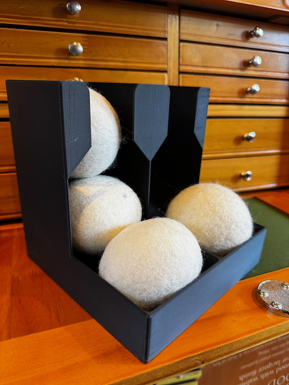
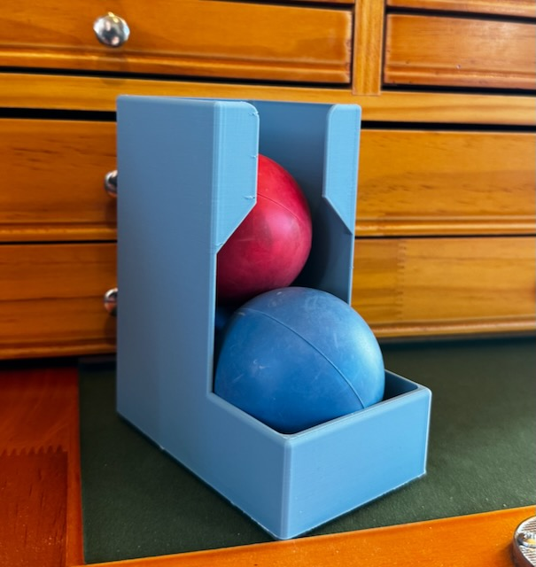
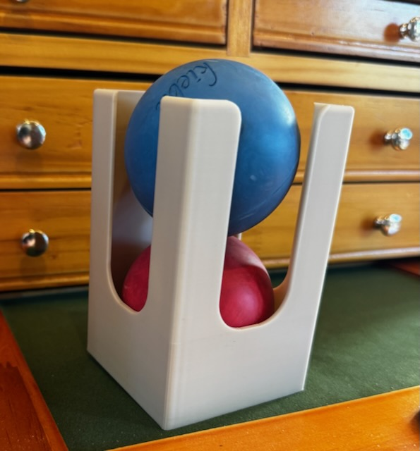

# Ball Rack

Generalized Ball Holder

This will build a 3D model to hold balls of various diameters worthy of realizing on your 3D Printer. I have used this model to
create a holder for wool dryer balls that fastens to the wall and lacrosse balls that sits on a table in the exercise room.

## Model Parameters

| Parameter            | Description                                                                                                                                                                |
| -------------------- | -------------------------------------------------------------------------------------------------------------------------------------------------------------------------- |
| ball_diameter        | Diameter of the ball in millimeters. Include spacing so that it is not too tight.                                                                                          |
| balls_per_column     | Number of balls to hold in each column.                                                                                                                                    |
| columns              | Number of columns in the ball holder.                                                                                                                                      |
| trim_top_pct         | Percentage of a single ball to trim off the top of the ball rack. This is to let the top of the ball show out the top or help it fit within the maximum Z of your printer. |
| screw_mount          | Set to false if you do not want to have the keyhole screw mounts for the model.                                                                                            |
| screw_head_diameter  | Screw head diameter in millimeters for the mounting screw.                                                                                                                 |
| screw_shaft_diameter | Screw shaft diameter in millimeters for the mounting screw.                                                                                                                |
| feeder               | If true, the ball holder will have a ball feeder at the bottom. Otherwise the balls need to be pulled from the top.                                                        |
| side_cutouts         | Set to true to put cutouts on the sides of the holder to reduce filament use.                                                                                              |

## Realized Models

The `models` folder contains generated STL files that you can print on your 3D printer.  My use case was for lacrosse balls in my 
exercise room and wool dryer balls in our laundry room.  I have generated various configurations with the following naming 
conventions:

- `*-dryer-80mm-*`: is for a wool dryer ball of 80mm with tolerance.
- `*-lacross-64mm-*`: is for a lacrosse ball.
- `*-feeder-*`: the rack has a feeder at the bottom.
- `*-2col*`: The rack has two columns.
- `*-screw-mount-*`: There are keyholes for mounting the ball rack.

Also in the `models` folder is `*.3mf` files.  These are [Orca Slicer](https://orcaslicer.com) project files that I used.  
`*-a1mini.3mf` project file is for a Bambu Lab A1 mini.  `*-mk3.3mf` is for a Prusa MK3S+ printer.

## Dependencies and Building

This model is built using the tools listed below. Install these tools and you can open up the SCAD file
in this repo to create your own printable object.  Once installed, you can use the _Customizer_ UI in OpenSCAD 
to modify the model to fit your needs.  I do recommend installing the [development snapshot of OpenSCAD](https://openscad.org/downloads.html#snapshots) 
for the best experience.

- [OpenSCAD](https://openscad.org)
- [The Belfry OpenScad Library, v2.0.](https://github.com/BelfrySCAD/BOSL2)

## Example Output

A wool dryer ball rack using the following parameters:

```
ball_diameter = 80;
balls_per_column = 2;
columns = 2;
trim_top_pct = 0.50;
screw_head_diameter = 12;
screw_shaft_diameter = 6;
feeder = true;
feeder_scale = 1;
side_cutouts = false;
screw_mount = true;
```



Lacrosse Ball Rack, no screw holes, and a feeder tray.



Lacrosse Ball Rack with no feeder tray.




