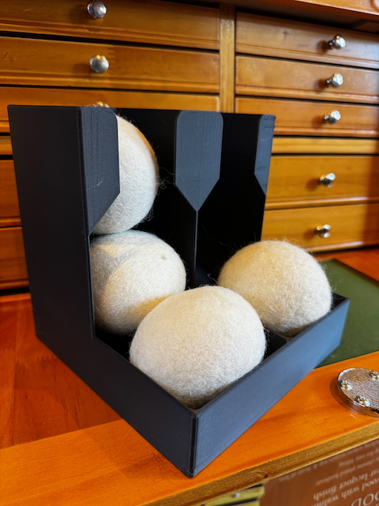

# Ball Rack

Generalized Ball Holder

This will build a 3D model to hold balls of various diameters worthy of realizing on your 3D Printer. I have used this model to
create a holder for wool dryer balls that fastens to the wall and lacrosse balls that sits on a table in the exercise room.

## Model Parameters

| Parameter            | Description                                                                                                                                                                |
| -------------------- | -------------------------------------------------------------------------------------------------------------------------------------------------------------------------- |
| ball_diameter        | Diameter of the ball in millimeters. Include spacing so that it is not too tight.                                                                                          |
| balls_per_column     | Number of balls to hold in each column.                                                                                                                                    |
| columns              | Number of columns in the ball holder.                                                                                                                                      |
| trim_top_pct         | Percentage of a single ball to trim off the top of the ball rack. This is to let the top of the ball show out the top or help it fit within the maximum Z of your printer. |
| is_screw_mount       | Set to false if you do not want to have the keyhole screw mounts for the model.                                                                                            |
| screw_head_diameter  | Screw head diameter in millimeters for the mounting screw.                                                                                                                 |
| screw_shaft_diameter | Screw shaft diameter in millimeters for the mounting screw.                                                                                                                |
| is_feeder            | If true, the ball holder will have a ball feeder at the bottom. Otherwise the balls need to be pulled from the top.                                                        |
| is_side_cutouts      | Set to true to put cutouts on the sides of the holder to reduce filament use.                                                                                              |

## Dependencies and Building

This model is built using the tools listed below. Install these tools and you can open up the SCAD file
in this repo to create your own printable object.

- [OpenSCAD](https://openscad.org)
- [The Belfry OpenScad Library, v2.0.](https://github.com/BelfrySCAD/BOSL2)

## Example Output

Below is a model that was realized from this project with the following parameters:

```
ball_diameter = 80;
balls_per_column = 2;
columns = 2;
trim_top_pct = 0.50;
screw_head_diameter = 12;
screw_shaft_diameter = 6;
is_feeder = true;
feeder_scale = 1;
is_side_cutouts = false;
is_screw_mount = true;
```



